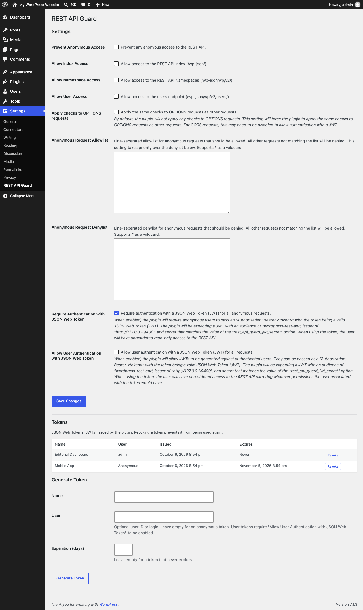

# REST API Guard

[](https://github.com/alleyinteractive/wp-rest-api-guard/actions/workflows/all-pr-tests.yml)
[](https://wordpress.org/plugins/rest-api-guard/)

Restrict and control anonymous access to the WordPress REST API, with optional JSON Web Token (JWT) authentication.

Requires WordPress 6.5+ and PHP 8.3+.

The WordPress REST API is public by default and shares a good deal of information about your site with anyone who asks. REST API Guard makes it easy to decide who can see what.

Out of the box, the plugin:

- Blocks anonymous access to the users endpoint (`/wp/v2/users`) so usernames aren't exposed.
- Blocks anonymous access to the REST API index (`/`) and namespace endpoints (`/wp/v2`) so visitors can't list your plugins and post types.

It can also:

- Block all anonymous access to the REST API.
- Allow anonymous access only to specific routes (allowlist), or block specific routes (denylist).
- Require anonymous requests to include a JSON Web Token (JWT).
- Let users authenticate with a JWT tied to their account.
- Generate, list, and revoke tokens from the settings page or WP-CLI.

## Installation

Install the plugin from [WordPress.org](https://wordpress.org/plugins/rest-api-guard/) or with Composer:

```bash
composer require alleyinteractive/wp-rest-api-guard
```

## Usage

Every option is available on the settings page (**Settings → REST API Guard**) and as a filter for configuring the plugin in code. A setting controlled by a filter is shown as read-only on the settings page.



To configure the plugin entirely in code and hide the settings page:

```php
add_filter( 'rest_api_guard_disable_admin_settings', '__return_true' );
```

The restrictions only apply to anonymous requests. Logged-in users, including the block editor, have the same REST API access WordPress normally gives them.

### Restrict access to user information

Anonymous access to `/wp/v2/users` is blocked by default. To allow it:

```php
add_filter( 'rest_api_guard_allow_user_access', '__return_true' );
```

### Restrict access to the index and namespace endpoints

Anonymous access to the index (`/`) and namespace (`/wp/v2`) endpoints is blocked by default. To allow it:

```php
add_filter( 'rest_api_guard_allow_index_access', '__return_true' );
add_filter( 'rest_api_guard_allow_namespace_access', '__return_true' );
```

### Block all anonymous access

```php
add_filter( 'rest_api_guard_prevent_anonymous_access', '__return_true' );
```

### Allow anonymous access to specific routes (allowlist)

When an allowlist is set, anonymous requests to any route not on the list are denied. The allowlist takes priority over the denylist. Use `*` as a wildcard.

```php
add_filter(
	'rest_api_guard_anonymous_requests_allowlist',
	fn () => [
		'/wp/v2/posts*',
		'/custom-namespace/v1/public/*',
	]
);
```

### Deny anonymous access to specific routes (denylist)

Anonymous requests to routes on the denylist are denied. All other routes are allowed. Use `*` as a wildcard.

```php
add_filter(
	'rest_api_guard_anonymous_requests_denylist',
	fn () => [
		'/wp/v2/comments*',
		'/custom-namespace/v1/private/*',
	]
);
```

### OPTIONS requests

`OPTIONS` requests aren't checked by default, since browsers send them as CORS preflight requests without credentials. To check them too:

```php
add_filter( 'rest_api_guard_check_options_requests', '__return_true' );
```

## JSON Web Token (JWT) Authentication

### Require a JWT for anonymous requests

Anonymous requests can be required to send a token in an `Authorization: Bearer <token>` header:

```php
add_filter( 'rest_api_guard_authentication_jwt', '__return_true' );
```

Tokens are expected to have an audience of `wordpress-rest-api` and an issuer of the site URL. Both can be changed:

```php
add_filter( 'rest_api_guard_jwt_audience', fn () => 'custom-audience' );
add_filter( 'rest_api_guard_jwt_issuer', fn () => 'https://example.com' );
```

Tokens are signed with a secret generated automatically and stored in the `rest_api_guard_jwt_secret` option. It can also be set in code:

```php
add_filter( 'rest_api_guard_jwt_secret', fn () => 'my-custom-secret' );
```

### Authenticate users with a JWT

Tokens can also be tied to a user. A request with a user token is treated as that user, with the same permissions they have:

```php
add_filter( 'rest_api_guard_user_authentication_jwt', '__return_true' );
```

Additional claims can be added to user tokens with the `rest_api_guard_jwt_additional_claims` filter. Existing claims can't be overwritten.

### Generate, list, and revoke tokens

Tokens can be generated from the **Tokens** section of the settings page. Give each one a name so you can tell them apart later, and optionally tie it to a user or set an expiration. The token is shown once after it's generated, so copy it somewhere safe.

The same section lists every token the plugin has issued, and any of them can be revoked. A revoked token stops working right away.

Tokens can also be managed with WP-CLI:

```bash
wp rest-api-guard generate-jwt [--name=<name>] [--user=<user-id>] [--expiration=<seconds>]
wp rest-api-guard list-jwts
wp rest-api-guard revoke-jwt <id>
```

Or generated in code:

```php
$token = \Alley\WP\REST_API_Guard\generate_jwt(
	expiration: HOUR_IN_SECONDS, // Optional. Seconds until the token expires.
	user: 1,                     // Optional. A user ID or WP_User.
	name: 'Mobile App',          // Optional. A name to identify the token by.
);
```

Tokens issued before version 1.5.0 aren't tracked, so they can't be listed or revoked one at a time. They're still accepted by default. To reject them:

```php
add_filter( 'rest_api_guard_allow_untracked_jwt', '__return_false' );
```

Changing the `rest_api_guard_jwt_secret` option invalidates every token issued so far, tracked or not.

### Caching

Responses to REST API requests that include an `Authorization` header are sent with no-cache headers so a page cache or CDN doesn't store them.

## Testing

Run `composer test` to run PHPCS and PHPUnit.

## Changelog

See the [CHANGELOG](CHANGELOG.md) for what has changed recently.

## Credits

This project is actively maintained by [Alley Interactive](https://github.com/alleyinteractive). Like what you see? [Come work with us](https://alley.co/careers/).


- [Sean Fisher](https://github.com/srtfisher)
- [All Contributors](../../contributors)

## License

The GNU General Public License (GPL) license. Please see [License File](LICENSE) for more information.
